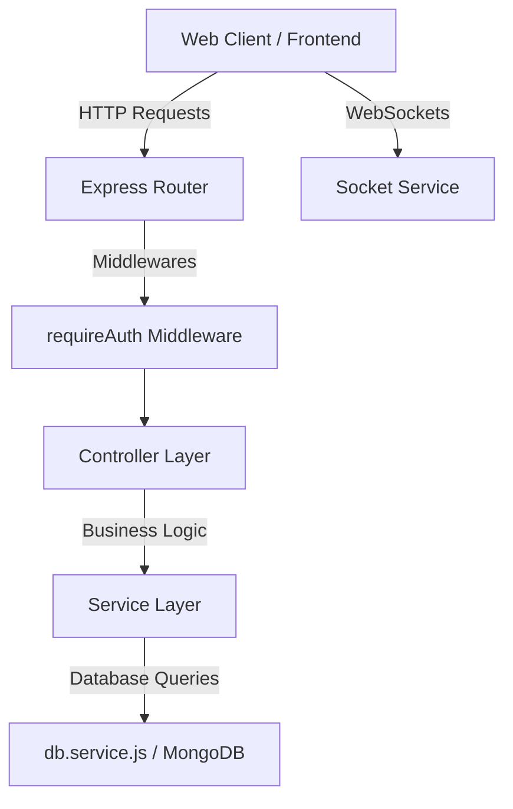

# PlatypusBNB Backend

[](./.nvmrc)
[](./LICENSE)
[](https://platypusbnb.onrender.com/)

## Project Status

**Experimental** (Coding Academy Project)

---

## Overview

PlatypusBNB Backend is a Node.js and Express application designed to serve as the server-side API and runtime environment for the PlatypusBNB booking platform. It connects to a MongoDB database to manage listings (stays), bookings (orders), and user sessions.

The PlatypusBNB project is split into two separate repositories:
- **Frontend Client**: [ca-platypusbnb-frontend](https://github.com/aviad-benhamo/ca-platypusbnb-frontend)
- **Backend API**: [ca-platypusbnb-backend](https://github.com/aviad-benhamo/ca-platypusbnb-backend)

Additionally, to simplify deployment and local testing, this backend repository serves prebuilt static frontend client assets directly from the `public/` directory (**Option A**).

---

## Features

- **Authentication & Authorization**: Secure session management utilizing encrypted cookie storage.
- **Stays / Listings API**: Query, filter, and detail endpoints for booking listings.
- **Orders / Bookings API**: Manage and process reservations.
- **Real-Time Communication**: Integrates Socket.io to push real-time notifications (e.g., booking confirmations) to clients.
- **Logging**: Integrated custom logging service for tracking requests and server events.

---

## Screenshots / Demo

- **Live Demo Website**: [https://platypusbnb.onrender.com](https://platypusbnb.onrender.com)
- **Screenshots**: UI screenshots and media are currently deferred for this backend-focused repository.

---

## Quick Start

### Prerequisites

This project requires Node.js version **24.6.0** or newer. You can use [nvm](https://github.com/nvm-sh/nvm) to set the correct environment:

```bash
nvm use
```

### Installation

1. Clone the repository locally:
   ```bash
   git clone https://github.com/aviad-benhamo/ca-platypusbnb-backend.git
   cd ca-platypusbnb-backend
   ```

2. Install the package dependencies:
   ```bash
   npm install
   ```

3. Create your local environment configuration file:
   ```bash
   cp .env.example .env
   ```
   *Edit the `.env` file and set the required variables (specifically `MONGO_URL`).*

4. Run the development server with hot-reloading:
   ```bash
   npm run dev
   ```
   *The server will start on port `3030` by default (http://localhost:3030).*

5. Run in production mode:
   ```bash
   npm start
   ```

---

## Configuration

The application is configured using environment variables defined in your `.env` file:

| Variable | Required | Description | Default |
| :--- | :---: | :--- | :--- |
| `MONGO_URL` | **Yes** | MongoDB connection string URI | - |
| `SECRET1` | No | Secret key used to sign and encrypt session cookies | - |
| `DB_NAME` | No | Target MongoDB database name | `platypusbnb_db` |
| `PORT` | No | Network port the server listens on | `3030` |
| `NODE_ENV` | No | Mode environment configuration (`development` or `production`) | `development` |

---

## Design Principles

- **Separation of Concerns**: Decouples API endpoints (routes), request handling (controllers), and database operations (services).
- **Stateless Controllers**: Controllers handle parsing requests, executing basic validation, and returning HTTP responses. Services handle database queries and business logic.
- **Minimal Dependencies**: Keeps core library sizes small to improve performance and maintenance overhead.

---

## Project Structure

```text
├── api/                             # API Modules (Routes, Controllers, and Services)
│   ├── auth/                        # User authentication endpoints and logic
│   │   ├── auth.controller.js
│   │   ├── auth.routes.js
│   │   └── auth.service.js
│   ├── order/                       # Booking orders logic
│   │   ├── order.controller.js
│   │   ├── order.routes.js
│   │   └── order.service.js
│   ├── stay/                        # Listings / Stays endpoints and logic
│   │   ├── stay.controller.js
│   │   ├── stay.routes.js
│   │   └── stay.service.js
│   └── user/                        # User accounts management logic
│       ├── user.controller.js
│       ├── user.routes.js
│       └── user.service.js
├── config/                          # Configuration environments (dev, prod)
├── data/                            # Local storage data files
├── docs/                            # Documentation and Architecture Decision Records (ADRs)
│   └── decisions/
│       └── 0001-committed-frontend-assets.md
├── logs/                            # Server logs output directory
├── middlewares/                     # Express middleware functions (logger, requireAuth)
├── public/                          # Prebuilt static frontend assets (served by Express)
│   └── assets/                      # Compiled JS, CSS, and UI resource bundles
├── services/                        # Shared system services (db connection, socket, logger)
├── .editorconfig                    # Shared editor formatting settings
├── .env.example                     # Environment variables configuration template
├── .gitattributes                   # Git attributes for line endings and paths
├── .gitignore                       # Git ignored files list
├── .nvmrc                           # Node.js active runtime version baseline
├── LICENSE                          # MIT License information
├── package.json                     # Node.js project manifest and dependency specification
├── SECURITY.md                      # Security vulnerability reporting protocol
└── server.js                        # Main Express application entrypoint
```

---

## Architecture



- **Data Flow**: Incoming HTTP requests match routes in the `api/` folder. The request is passed to a Controller, which queries the corresponding Service to access database collections.
- **Authentication**: Stateless JWT-like custom encrypted cookie tokens manage sessions securely without server-side memory sessions.
- **Static Asset Serving**: Express serves static assets directly from the `public/` directory, letting the server run as a standalone full-stack package for quick deployment.

---

## Development

### Scripts
- `npm run dev`: Start the server with `nodemon` to watch and reload on file changes.
- `npm start`: Start the server directly using standard Node.js execution.

### Test & Validation Strategy
- **Automated Tests**: There are currently no automated unit or integration tests set up in this repository.
- **Manual Verification**: Endpoint testing is conducted manually using API clients (e.g., Postman, curl) and by accessing the frontend interface served locally.

---

## Roadmap

See [ROADMAP.md](./ROADMAP.md) for the detailed project roadmap and future milestones.

---

## Changelog

See [CHANGELOG.md](./CHANGELOG.md) for the full history of notable changes.

---

## License

This project is licensed under the MIT License. See [LICENSE](./LICENSE) for the full license text.
